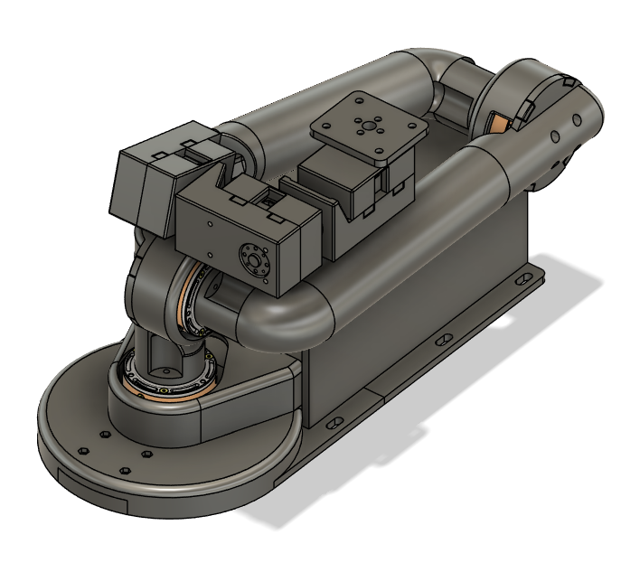
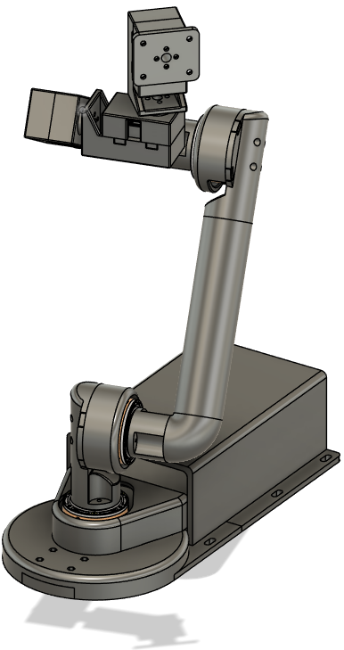
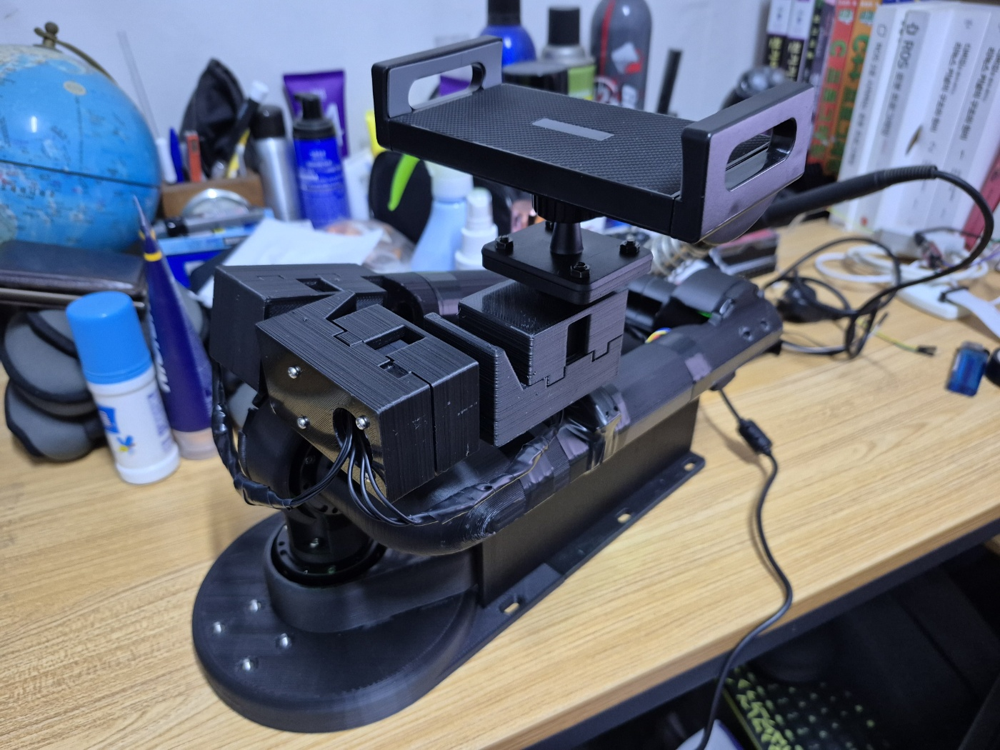
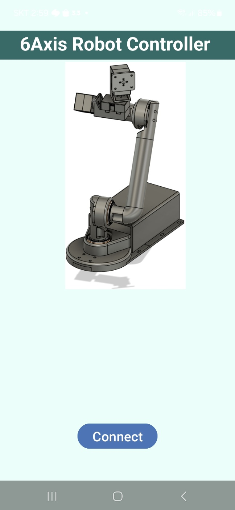
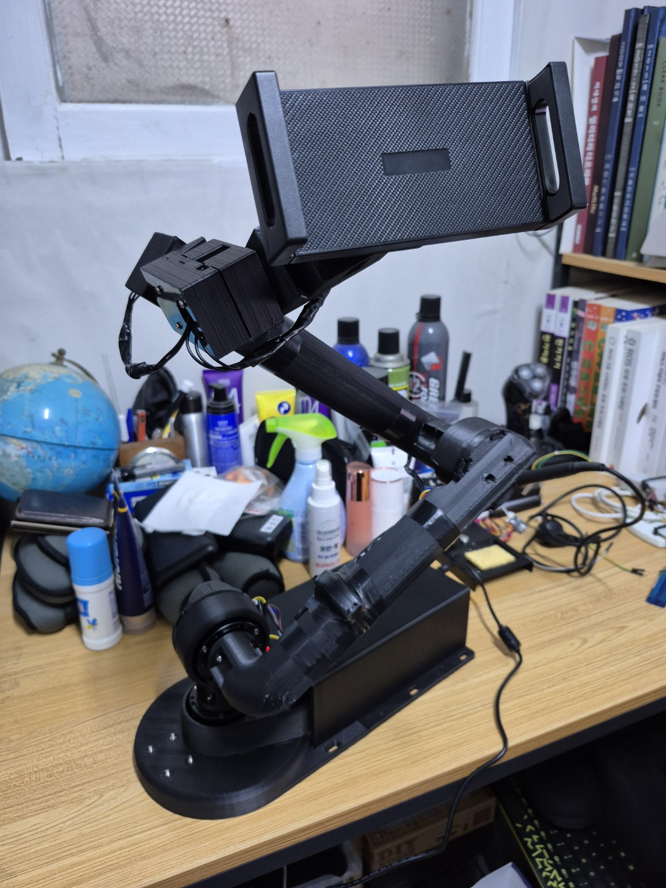
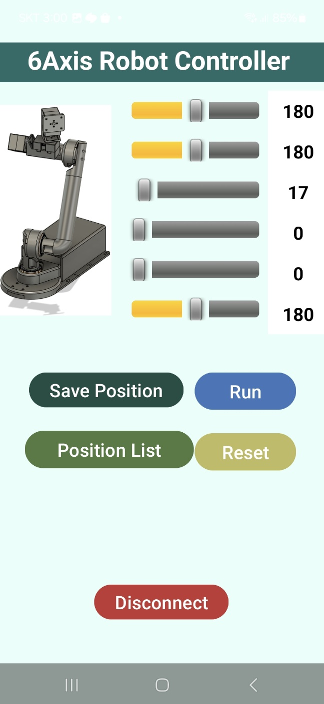
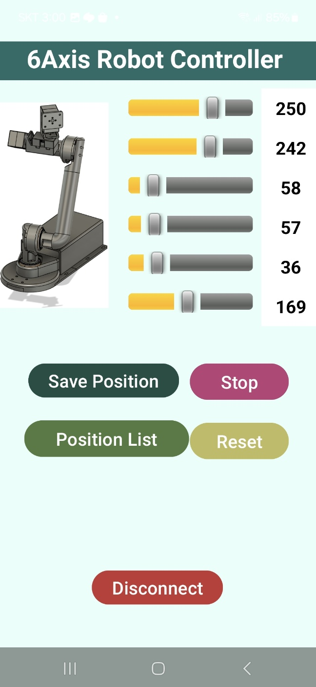
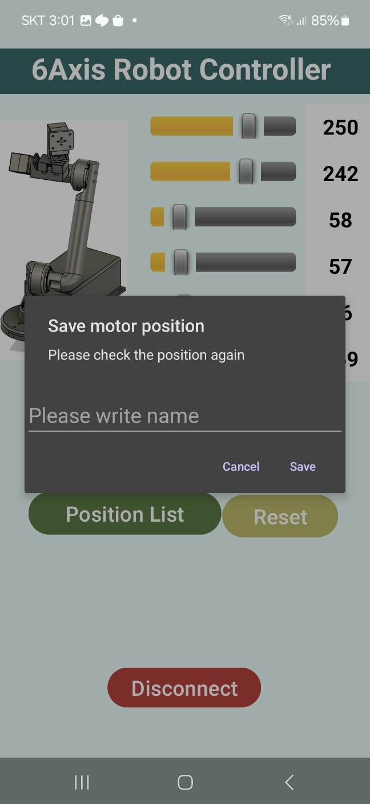
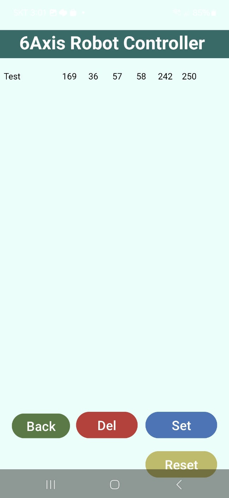

Start : 2024. 12. 18
====================
v1.0 End : 2025. 02. 03
======================
   
## Introduction
 This project is a compilation of documents that I developed for my 6-axis manipulator robot.   
</img> </img>
   
### Ver 1.0 Implement
 #### Initialize
</img>

 ##### The robot is initialized in the following cases:   
1. Power on the robot
2. Connect the App to the robot
3. Press the Reset button on the App
</img>

 #### Motor control
</img>

 ##### To control each joint of the robot, we use the following methods:   
1. Set the motor angle by sliding or typing numbers
2. Press the RUN button to operate the motor according to the set angle value
3. Adjust the angle in the RUN state to operate the motor
</img> </img>
   
 #### Save motor position
 ##### To save the robot's position, use the following method:   
1. Set the desired motor angle in the App and click the Save position button
2. Enter a name and click Save
</img>
   
 #### Load motor position
 ##### To load the robot's position, use the following method:   
1. Click the Position list button
2. Click one of the saved positions and click the Set button
</img>

 #### Voice Commands
 ##### To control the robot's position with voice commands, use the following method:   
1. Start of voice command is "Hello robot"
2. Each custom command operates according to the saved position
3. "Reset" command to initialize the robot

## Reference
 For detailed development information, please refer to the Excel file in the document folder.   
 [Dev Doc](./Document/6_Axis_Robot.xlsx)   
    
 Thank you.